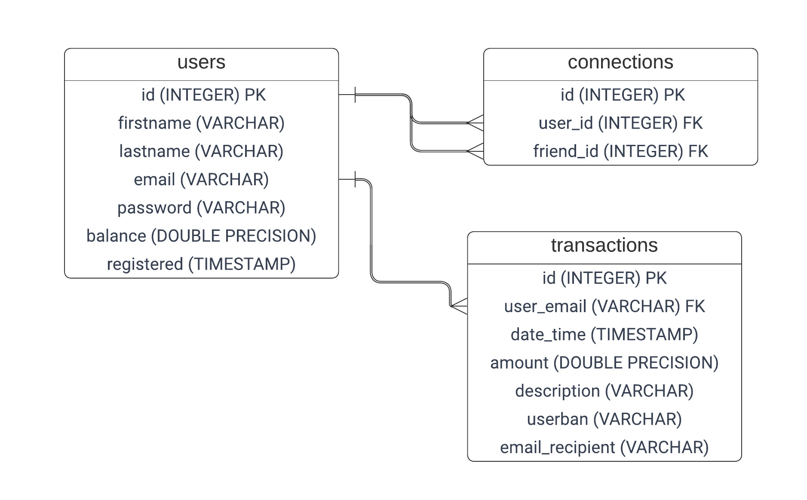
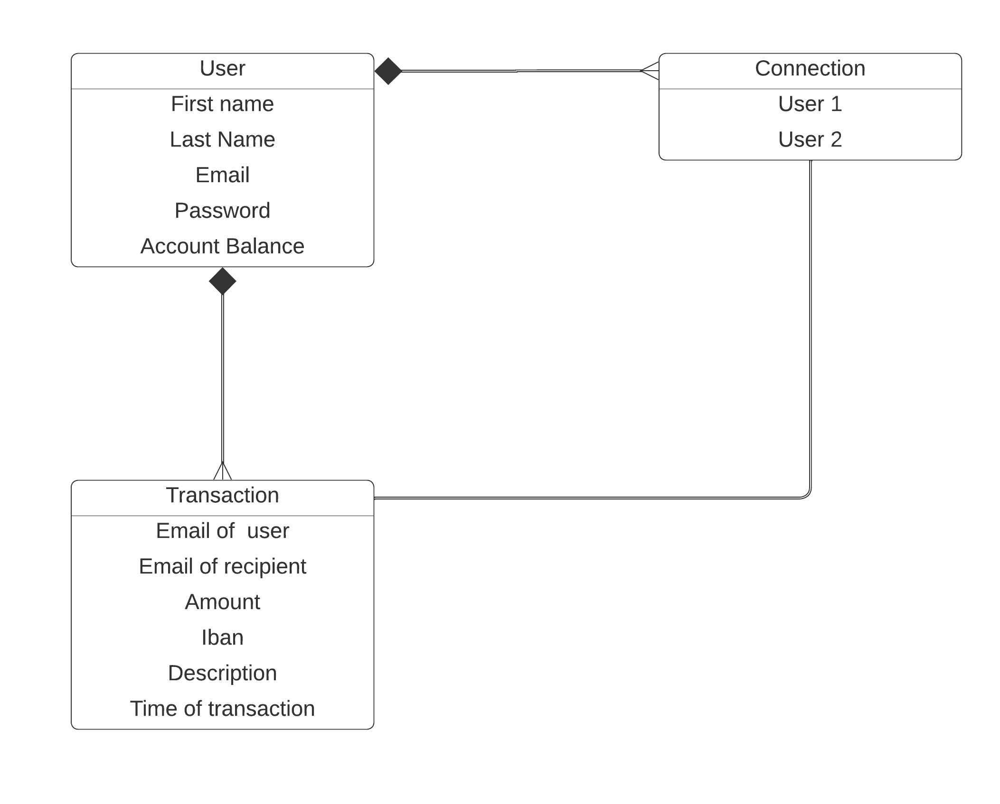

PayMyBuddy
========================

Description
------------
Pay My Buddy is an application that allows you to transfer money to your friends provides functionality to store and
manage user information and transactions.

### Features

- User registration and login
- User account balance management
- User transactions history management
- User friend connections management

Getting Started
------------

### Prerequisites

Install the following software on your system:

- Java 8 or higher
- Maven 3.0 or higher
- PostgreSQL 9.5 or higher

### Installation

- Clone the repository to your local machine

```
git clone https://github.com/AnatolyRytik/paymybuddy.git
```

- Navigate to the project directory

```
cd "your_project_directory"
```

- Create a PostgreSQL database named "payme"

```
CREATE DATABASE payme;
```

- run the project's SQL script that is located in: src / main / resources / db / initDB.sql
- Update the application.properties file with your PostgreSQL credentials

```
# Application.properties
spring.datasource.url=jdbc:postgresql://localhost:5432/payme
spring.datasource.username=your_postgres_username
spring.datasource.password=your_postgres_password
```

- Build the project

```
mvn clean install
```

- Run the project

```
mvn spring-boot:run
```

### Built With

- Java 11
- PostgreSQL
- Spring Boot
- Spring Data JPA
- Spring Security

## Modelization

### Physical data model



### Class Diagram


